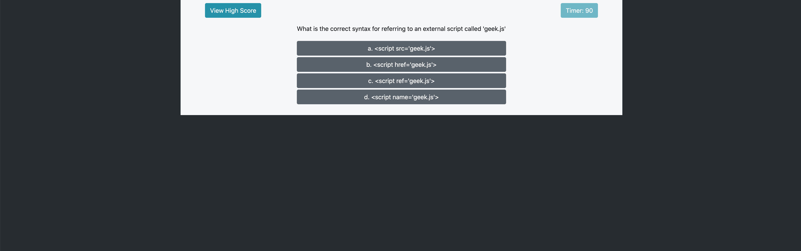

# Javascript Code Quiz

## Description

This code quiz will test your basic understanding of Javascript. 

## Instructions
'''You will have 100 seconds to answer 5 questions.
For each question missed, 10 seconds will be deducted from your time.
At the end of the Quiz your remaining time will be your score.

You may view the highest score at any point in time by clicking "View High Score".
'''

## Screenshots

### Review

* Deployed Application - 04-code-quiz - https://smrodriguez88.github.io/04-code-quiz/

* Github Repository - 04-code-quiz - https://github.com/smrodriguez88/04-code-quiz

